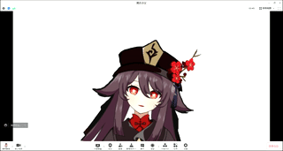

<!--
 * @Date: 2022-05-19 15:40:47
 * @LastEditors: Wu Han
 * @LastEditTime: 2022-05-19 17:06:23
 * @FilePath: \test\readme.md
-->
# Live2d 动捕虚拟摄像头
适用于 Windows 端的 QQ 、腾讯会议等多款视频通话软件

## 效果
先来点效果吧，不然人都跑了-。-



## 使用方法

- 软件需求
    - python 环境（本人环境3.8.5）

下载解压或者 git clone 源代码，进入仓库。初次使用需要执行相关库的安装

```
pip install -r requirements.txt -i https://pypi.tuna.tsinghua.edu.cn/simple
```

运行时需要在 cmd 窗口里输入 python winapi.py 即可

默认是胡桃的 Live2D，也提供了公子和 hiyori 的模型，如果需要换别的模型请自备好 model3 类型的模型，将文件夹放在 static 下，修改 static/script.js 里的模型位置那一行即可

## 思路

动捕（ web 端实现）+ 窗口总在最前无焦点（ winapi ） + 虚拟摄像头驱动（pyvirtualcam + obsvirtualcam ） + d3dshot 截图 + 推流

可以说是站在一堆开源巨佬的肩膀上做了一些简单的缝合... 并且手段其实并不高明，无法实现后台的渲染，总之能用就行

obs&facerig 太大了并且学习成本比较高（<del>更重要的是不够 geek</del>）所以写了一个小程序满足了一下自己的好奇心-。- 如果只是想玩一玩的朋友们也可以下载下来试试

## 存在的问题

- 如果你的笔记本电脑是混合显卡(集显 + 独显) 你可能需要把 python gui 设置成集显优先才能用 d3dshot 进行截图，具体可见[安装说明：笔记本电脑上的 D3DShot](https://github.com/SerpentAI/D3DShot/wiki/Installation-Note:-Laptops) 

- 双屏的时候可能有点问题 还有待研究

## 鸣谢

上文也说了，这个项目是站在开源大佬的肩膀上的，这里把对这个小项目有所贡献的人&项目做一个清单-。-

首先感谢自家宝贝儿 本身这个项目就是找了一个 web 端的仓库准备 520 给她一个惊喜，是她提醒了我还可以输出到摄像头里作为一个虚拟输入，然后我才做了相关的实现。并且胡桃模型的润色和修改也是她做的！<!-- （在这里撒狗粮应该没人发现吧嘻嘻 永远爱你宝贝儿） -->（羡慕有手的画画人 x

然后要感谢龚 sir 不厌其烦的被我骚扰（大雾 作为老二次元人提出了宝贵的指导意见 <del>指添加变声器</del>


后面放上一些库&资源的来源 感谢开源 🎉

- [网页动捕](https://github.com/yeemachine/kalidokit)
- [虚拟摄像头驱动](https://github.com/CatxFish/obs-virtual-cam)
- [python适配虚拟摄像头api](https://github.com/letmaik/pyvirtualcam)
- [d3dshot](https://github.com/SerpentAI/D3DShot)
- [胡桃模型原作](https://github.com/zeankundev/HuTao-Live2D)
- [hiyori原作](https://github.com/KennardWang/VTuber-MomoseHiyori)
- [达达利亚原作](https://www.bilibili.com/s/video/BV1h5411w754)